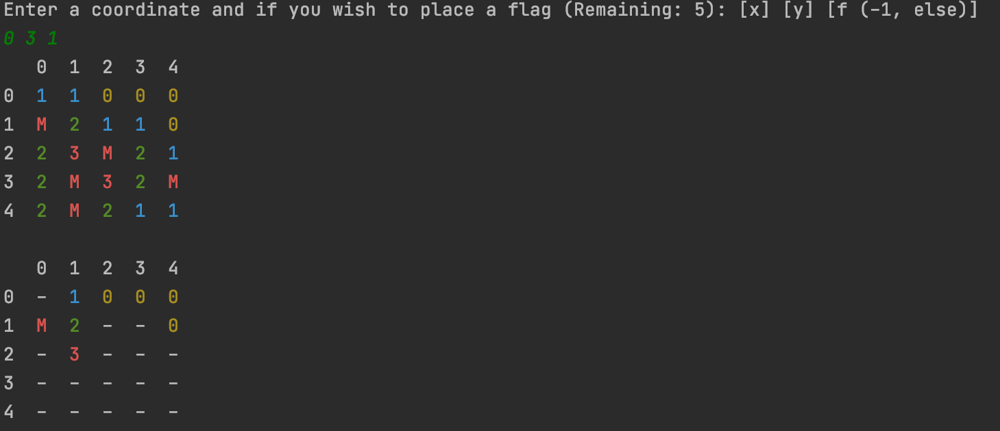
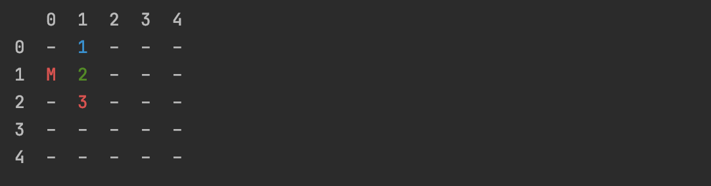
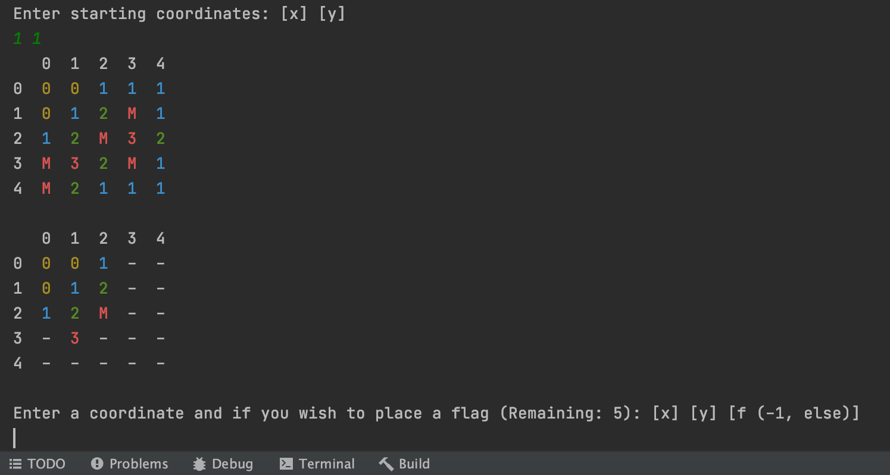

# CSCI 1933 Project 4: Stacks, Queues, and Minefield!
Welcome to the fourth and final CSCI 1933 project! All students are expected to understand the rules listed below. While some rules may seem unforgiving, all guidelines are made to help the TAs grade efficiently and fairly. **As a result, we will generally not make exceptions.** Rules listed in the syllabus also apply but may not be listed here.

### **Make sure you read this entire write-up *carefully* before starting your project.**

### **Do not distribute or post this project outside of the course.**

* **Due Date:** The project is due on **Friday, May 2** by **11:59** on **Gradescope**.
    * The project can be submitted up to two days late, with a penalty: -10% for each day late.

* **Identification:** Place you and your partner's x500 in a comment near the top of all files you submit. Failure to do so may result in a penalty.

* **Partners:**  You may work alone or with **one** partner. Failure to tell us who is your partner is indistinguishable from cheating and you will both receive a zero. Ensure all code shared with your partner is private.

* **Code:** You must use the **EXACT** class and method signatures we ask for. This is because we may use a program to evaluate your code. Code that doesn't compile will receive a significant penalty. Code should be compatible with Java 19, which is installed on the CSE Labs computers. Credit **ALL** outside references used in completing this project both in the INFO.txt and within the code that utilizes the referenced material.

* **Questions:** Questions related to the project can be discussed on Discord in abstract. This relates to programming in Java, understanding the writeup, and topics covered in lecture and labs. **Do not post any code or solutions on the forum.** Do not e-mail the TAs your questions when they can be asked on Discord via a help ticket.

* **Grading:** Grading will be done by the TAs, so please address grading problems to them privately through the ticket system on Discord.

* **INFO.txt:** Make sure to include a INFO.txt in your submission that contains the following information:
    * Group member's names and x500s
    * Contributions of each partner (if applicable)
    * Any assumptions
    * Additional features that your project had (if applicable)
    * Any known bugs or defects in the program
    * Credit **ALL** outside references used in completing this project both in the INFO.txt file **and** *within the code that utilizes the referenced material*.
    * Include the statement: **“I certify that the information contained in this INFO file is complete and accurate. I have both read and followed the course policies in the ‘Academic Integrity - Course Policy’ section of the course syllabus.”** and type your name(s) underneath.

### IMPORTANT: You are NOT permitted to use ANY built-in libraries, classes, etc... EXCEPT java.util.Random, and java.util.Scanner. Double check that you have NO import statements in your code, except for those explicitly permitted.

## Code Style (5 Points)
Part of your grade will be decided based on the "code style" demonstrated by your programming. In general, all projects will involve a style component. This should not be intimidating, but it is fundamentally important. 
<br>
### The following items represent “good” coding style:
* **Use effective comments** to document what important variables, functions, and sections of the code are for. In general, the TA should be able to understand your logic through the comments left in the code.
    * *Try to leave comments as you program, rather than adding them all in at the end. Comments should not feel like arbitrary busy work - they should be written assuming the reader is fluent in Java, yet has no idea how your program works or why you chose certain solutions.*
* **Use effective and standard indentation.**
* **Use descriptive names for variables.** Use standard Java style for your names: ```ClassName```, ```functionName```, ```variableName``` for structures in your code, and ```ClassName.java``` for the file names.

Try to avoid the following stylistic problems:
* Missing or highly redundant, useless comments. ```int a = 5; //Set a to be 5``` is not helpful.
* Disorganized and messy files. Poor indentation of braces (```{``` and ```}```).
* Incoherent variable names. Names such as ```m``` and ```numberOfIndicesToCount``` are not useful. The former is too short to be descriptive, while the latter is much too descriptive and redundant.

The programming exercises detailed in the following pages will both be evaluated for code style. This will not be strict – for example, one bad indent or one subjective variable name are hardly a problem. 
<br>
**However, if your code seems careless or confusing, or if no significant effort was made to document the code, then points will be deducted.**

## Pulling the Project Files

Git is a version control system that helps you track changes to files in a project. We have been using it in labs for a while now, and cloning this project will follow the same steps as a lab.

Open your terminal/command line, and navigate to the top of the `CSCI-1933-Student-Code-Dovolis` directory using the `cd` command. Now, type the following:

```bash
  git pull
```

#### Note: If you want to set up your own repository for this project, you will need to move the `CSCI1933P4` directory into your new repository. Make sure your new repository is PRIVATE, so your work is not visible to others (besides you and your partner).


## Project Structure
### Your project submission must adhere to the following rules. Failure to do so will impact your grade.
* Your submission should be one ZIP file named ```<partner1 x500>_<partner2 x500>_Project4.zip```
    * This ZIP file should contain **ONLY** these files:
        * Minefield.java
        * Main.java
        * Cell.java
        * NGen.Java
        * Q1Gen.java
        * QGen.java
        * Stack1Gen.java
        * StackGen.java
        * **INFO.txt**

### For example, this is a valid project submission:
* kvant003_balle137_Project4.zip
    * Minefield.java
    * Main.java
    * Cell.java
    * NGen.Java
    * Q1Gen.java
    * QGen.java
    * Stack1Gen.java
    * StackGen.java
    * **INFO.txt**

## Project Overview

In this project you will be creating your own version of *Minesweeper* using stacks and queues. If you are unfamiliar with the game, it is recommended that you take a small amount of time to familiarize yourself with it. Here is the official Minesweeper
website: <a href="https://minesweepergame.com/strategy/how-to-play-minesweeper.php">LINK</a>, and here is a link to play Minesweeper in your browser <a href="https://g.co/kgs/FuSn36P">LINK</a>.

*Note: These websites should be used as a BRIEF overview of minesweeper. We will be implementing a slightly different version, therefore, some rules may vary.*

In Minefield, users are attempting to reveal every square of a given field while avoiding randomly placed mines. Each square has a value (1-8), that tells the user how many mines surround it in a 3x3 tile. A flag allows users to skip over squares they believe to be mines. Hit a mine, and the game is over. If you reveal all squares and place flags on all the mines, you win. For our version, you will be playing on a field, which is a two-dimensional array that will contain all the relevant information for the game.

There are two main features that require special attention to implement in Minefield: `revealZeroes()` and `revealStartingArea()`. These methods allow the user to reveal all surrounding zeros on the field **AND** the first mine(s) found given two starting coordinates, respectively. In Minefield, when the user chooses their starting coordinates, the game should reveal a large enough area to give enough information to start solving the field. Additionally, if a user chooses a square with a ’0’ value in it, meaning there are no mines, the field should also reveal all surrounding zeroes. **These two problems are suitable for utilizing stack and queue data structures and are the focus of this project.**

### Background and Getting Started
More detail about each method will be found in their respective sections. You will also be given a `Main` class that has a game loop, similar to the one you made for Chess in Project Two. Do not worry if you have not played *Minesweeper* before. It is recommended to play a few games of it to familiarize yourself with it but the description below explains the premise of the game.

*Minesweeper* relies on 3x3 tiles. In each of the cells within this 3x3 tile, a value is given based on the number of mines surrounding it.

#### Below are some examples:
1.  ```
    0 0 0 0 0
    0 1 1 1 0
    0 1 M 1 0
    0 1 1 1 0
    0 0 0 0 0
    ```
2. ```
    0 0 1 1 1
    0 1 2 M 1
    0 1 M 2 1
    0 1 1 1 0
    0 0 0 0 0
    ```
<ol>
    <li>
    Take note of how when no mines are present in a 3x3 area, a ’0’ is placed as the value.</li>
    <li>
    Here, and additional mine is placed, notice the difference in how now some cells have a ’2’.
    </li>
</ol>

## Provided Files
Along with this project write-up, you will be given the following files:
* `Minefield.java`: The Java class for your minefield implementation. **(You complete this file)**

* `Main.java`: The Java class containing the `main` function for your *Minefield* program. **(You complete this file)**

* `Cell.java`: A helper class for `Minefield.java`; *this file is complete and you do not have to edit it.*

* `NGen.java`: Both the queue and stack structure will utilize this generic node class; *this file is complete and you do not have to edit it.*

* `QGen.java`: An interface for a generic queue; *this file is complete and you do not have to edit it.*

* `Q1Gen.java`: An implementation of a generic queue; *this file is complete and you do not have to edit it.*

* `StackGen.java`: An interface for a generic stack; *this file is complete and you do not have to edit it.*

* `Stack1Gen.java`: An implementation of a generic stack; *this file is complete and you do not have to edit it.*

### Stack and Queue Implementations
Both the stack and queue data structures provided have basic functionality. Take a look at both classes to ensure you know how to instantiate and use them properly. They should be similar to the examples you have seen in lecture.

# Cell.java
You do not need to change the Cell class, but this section describes how a cell works. The cell class is how we represent each of the squares in the field. 

### The Cell class has the following attributes:

* `boolean revealed`: True if the Cell has been revealed to the user, false otherwise.

* `String status`: Contains information regarding the Cell's status.
    * `"-"`: Blank (default value)

    * `"F"`: Flagged by the user

    * `"M"`: Mine

    * `"0"` through `"8"`: Number of mines in the surrounding 3x3 tile.

Each of these attributes has their own getter and setter.

# Main.java (20 Points)
To play *Minefield*, the game will require a `Main` class. The exact implementation is up to you, but the `Main` class should have a game loop and the ability to take in user input.
Furthermore, there is an order in which this game should flow. 

### Specifically, three functions need to be called in the following order:

1. When a game is started, the main class should instantiate a new `Minefield` object based on user input, as well as whether or not the game should be played in **debug** mode.

2. After this, the game now has an empty field with which it should place mines on. This is done through the `Minefield` class's `createMines()` method.

3. Our field now has mines placed on it but does not have any useful information for the user. To help the user, we can change the statuses of each cell to reflect how many mines surround it. This is done through the `Minefield` class's `evaluateField()` method.

4. We are almost ready to begin playing, except our field does not have any of its cells revealed to the user yet. To do this, we must call the `Minefield` class's `revealStartingArea()` method.

5. Finally, the user should be able to do basic things such as taking a guess at a cell. This means the user can either attempt to reveal a cell they believe is safe or place a flag where they believe there is a mine.

## Additional Main.java Requirements
* Debug mode can either be on or off, if on, the entire board should be displayed with all cells revealed each turn.

* The dimensions and the number of mines are based on three levels that the user can choose from:
    * **Easy:** Rows: 5 Columns: 5 Mines: 5 Flags: 5

    * **Medium:** Rows: 9 Columns: 9 Mines: 12 Flags: 12

    * **Hard:** Rows: 20 Columns: 20 Mines: 40 Flags: 40

# Minefield.java (70 Points)
The `Minefield` class is where the majority of the work will take place. **The methods outlined in the class will all need to be implemented, but you can add any additional methods as you see fit.**

Each of the methods have short descriptions of what they should return or what their purpose is. Further information is given on specific methods in the following sections. All of these methods will need to be implemented, but the following are descriptions about the more challenging methods.

## guess(int x, int y, boolean flag) (10 Points)
When a user guesses a coordinate, the `guess()` method should do the following. It first should see if the guess is **in-bounds**—this may also be done in the `Main` class. Next, it should see if the user wishes to place a flag and, if so, whether or not there are enough flags remaining to place the flag. If the user did not place a flag, then the method should check to see if the user has hit a cell with a `"0"` status. If so, call the `revealZeroes()` method.

Finally, if the user hits a mine, end the game. 
<br>
**Make sure to also set the revealed status of the cell that the user guesses at the end of the method.**

## createMines(int x, int y, boolean flag) (15 Points)

This method will place all of our mines on our field. Until all mines has been placed, the method should randomly generate coordinates to place a mine. Before placing a mine, the method should **check to see if this coordinate has not been revealed, is not already a mine, and is not equal to the starting coordinates (these are the x and y parameters).** Otherwise, a new coordinate pair should be generated.

## evaluateField() (5 Points)
Loop through the entire field. When a mine is found in the field, increase the status of its neighbors by one (if the neighbor is not a mine).

## revealZeroes(int x, int y) (20 Points)

This method is used to reveal all surrounding zeroes when a user clicks on a square containing a status of `"0"`. At the bottom of the description you will see the desired output, notice how guessing one zero reveals all zeroes nearby. Here we are using an algorithm using a stack to accomplish this. Since a stack has a first-in-last-out structure, this will explore as far in one direction as possible for a `"0"` status. 

### The pseudo-code is as follows:
```
revealZeroes(int x, int y)

    Initialize a stack with the start index {x, y}. 
    //This should be the x and y values passed into the method.

    Loop until the stack is empty:

        Get the top element off the stack.

        Set the corresponding Cell’s revealed attribute as true.

        Push all valid neighbor’s coordinates to the stack.

    End Loop

End revealZeroes       
```
### IMPORTANT: A valid neighbor is one who is in-bounds, has not previously been revealed, and whose status is "0".

<br>
<br>

*Note: This pseudo-code should appear familiar. It is very similar to a Depth-First Search algorithm, this also shows why a stack is best used here.*

# revealStartingArea(int x, int y) (20 Points)

This method will help us reveal enough information for the user to get started at the beginning of each game. The image at the bottom shows the desired output. The goal of the algorithm is to loop until a mine is found. This will reveal enough of the field to help the user. We are instead using a queue here.

### The pseudo-code is as follows:
```HTML
revealStartingArea(int x, int y)

    Initialize a queue with the start index {x, y}. 
    //This should be the same x and y that were passed into the method.

    Loop until the queue is empty:

        Dequeue the front Cell of the queue.

        If the current cell is a Mine:

            break from the loop. The algorithm is complete.

        Set the corresponding Cell’s revealed attribute as true.

        End If

        Enqueue all reachable neighbors
        //in-bounds and have not already been visited, regardless of their statuses.

    End Loop

End revealStartingArea       
```


<br>
<br>

*Note: This pseudo-code should appear familiar. It is very similar to a Breadth-First Search algorithm, this also shows why a stack is queue used here.*

# ANSI Color Codes (5 Points)
You have become used to printing out information and reading text from the terminal. Until now, this has most likely always been in black and white. When playing Minefield, it would be useful to the player if each number was a different color. We fortunately have a simple way to accomplish this: ANSI Color Codes. These may look familiar to the Project Two's trick for displaying Unicode characters. The basic colors have been provided to you, but feel free to add more.

## Implementation of ANSI Color Codes

### Example: Turning a Printed String Red

* Start with: `System.out.println("Change my color!");`

* To print out in red, we need the color codes for red and grey.
    * `static final String ANSI_RED = "u001b[31m";`
    * `static final String ANSI_GREY_BG = "u001b[0m";`

* Combined these ANSI color codes make red text:
    * `System.out.println(ANSI_RED + "Change my color!" + ANSI_GREY_BG);`

#### IMPORTANT: The purpose of ending with ANSI_GREY_BG, is to act as a reset color. This way any text that is printed after will be reset back to a default color.

Feel free to make any number a specific color, just make sure that each number is unique.

Below is an example of the terminal utilizing these ANSI color codes. **This also shows an
example of what the final game should look like, with the first field being what debug
mode prints.**


# Grading Information

### Your program will be graded according to the following score breakdown:
* **Code Style:** 5 points

* **ANSI Color Codes:** 5 points

* **Minefield Class:** 70 points

    * **guess():** 10 points

    * **createMines():** 15 points

    * **evaluateField():** 5 points

    * **revealZeroes():** 20 points

    * **revealStartingArea():** 20 points

* **Main Class:** 20 points

# Acknowledgements

* Project created by UTA, Austin Franzen - April 2023

* Project updated, revised, and ported to Gradescope by UTA, Adam Kvant - May 2024

* Project ported to GitHub - UTAs: Samantha Ballesteros, Adam Kvant - May 2024

* Project maintained by TAs: Austin Franzen, angar016, Grant Johnston, and Adam Kvant
